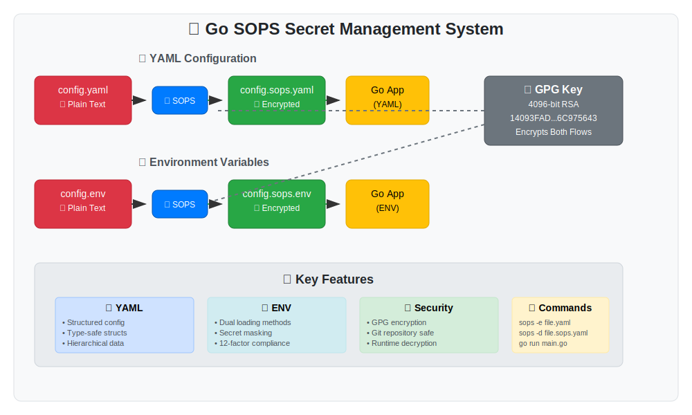

# 🔐 Go SOPS Secret Management

A comprehensive Go project demonstrating two powerful approaches for secure secret management using [SOPS (Secrets OPerationS)](https://github.com/mozilla/sops) with GPG encryption. This repository showcases both **YAML configuration** and **environment variable** encryption patterns for production-ready applications.



## 🌟 Project Overview

This project implements **dual secret management strategies** to cover different use cases:

### 📄 YAML Configuration Management (`yaml/` folder)
Perfect for **structured application configuration** with hierarchical data like database connections, service endpoints, and complex settings.

### 🌍 Environment Variable Management (`env/` folder) 
Ideal for **12-factor app compliance** with encrypted environment variables, API keys, and deployment-specific configurations.

## 🏗️ Project Structure

```
go-sops/
├── 📄 README.md                    # This comprehensive guide
├── 🎨 system-design.svg            # System architecture diagram
│
├── 📂 yaml/                        # YAML Configuration Management
│   ├── config.yaml                 # Original plaintext config (backup)
│   ├── config.sops.yaml            # 🔒 SOPS-encrypted YAML config
│   ├── go.mod                      # Go module for YAML implementation
│   ├── main.go                     # Go app with structured config loading
│   └── README.md                   # Detailed YAML implementation guide
│
└── 📂 env/                         # Environment Variable Management  
    ├── config.env                  # Original plaintext env file (backup)
    ├── config.sops.env             # 🔒 SOPS-encrypted env variables
    ├── go.mod                      # Go module for ENV implementation
    ├── main.go                     # Go app with dual env loading methods
    ├── .sops.yaml                  # SOPS configuration for .env files
    ├── sops-env-demo.sh            # Interactive demo script
    └── README.md                   # Detailed ENV implementation guide
```

## 🚀 Quick Start

### Prerequisites

```bash
# Install required tools
brew install sops gnupg

# Clone and navigate to project
git clone https://github.com/YslamB/go-sops.git
cd go-sops
```

### 🎯 Option 1: YAML Configuration Management

```bash
cd yaml/
go mod tidy
go run main.go
```

**Perfect for:**
- Structured application configuration
- Database connection settings  
- Service endpoint configurations
- Hierarchical configuration data

### 🎯 Option 2: Environment Variable Management

```bash
cd env/
go mod tidy
go run main.go
```

**Perfect for:**
- 12-factor app methodology
- API key management
- Deployment-specific variables
- Container-based deployments

## 📊 Feature Comparison

| Feature | 📄 YAML Implementation | 🌍 ENV Implementation |
|---------|------------------------|----------------------|
| **Use Case** | Structured app config | Environment variables |
| **Data Structure** | Hierarchical YAML | Key-value pairs |
| **Go Integration** | Type-safe structs | `os.Getenv()` + structs |
| **Loading Methods** | Single method | Dual methods |
| **Best For** | Complex configurations | Simple key-value secrets |
| **12-Factor Compliance** | Partial | Full |
| **Container Ready** | ✅ Yes | ✅ Yes |
| **Secret Masking** | Basic | Advanced |

## 🔒 Security Architecture

Both implementations use the same robust security model:

### 🔑 GPG Encryption
- **Key Algorithm**: RSA 4096-bit
- **Key Fingerprint**: `14093FAD0219A1D1B52761B4A88742FB6C975643`  
- **Usage**: Encrypts both YAML and ENV files

### 🛡️ Security Benefits
- ✅ **Secrets encrypted at rest** in your repository
- ✅ **Version control safe** - no plain text secrets
- ✅ **Access control** via GPG key distribution
- ✅ **Runtime decryption** - secrets only in memory
- ✅ **Easy rotation** with SOPS edit commands

## 💻 Development Workflow

### 1. Edit Encrypted Secrets
```bash
# For YAML config
sops yaml/config.sops.yaml

# For ENV variables  
sops env/config.sops.env
```

### 2. Version Control
```bash
# Safe to commit encrypted files
git add yaml/config.sops.yaml env/config.sops.env
git commit -m "Update encrypted configurations"
```

### 3. Deploy and Run
```bash
# YAML approach
cd yaml && go run main.go

# ENV approach  
cd env && go run main.go
```

## 📄 YAML Implementation Deep Dive

The YAML implementation provides **structured configuration management** with the following features:

### Configuration Structure
```yaml
storage:
  psql:
    host: 127.0.0.1
    port: 5432
    database: testtt
    username: postgres
    password: 12345      # 🔒 Encrypted with SOPS
    pg_pool_max_conn: 400
  redis:
    addr: localhost
    port: 6379
    username: user
    password: secu4e     # 🔒 Encrypted with SOPS
    db: 0
jwt:
  auth: SECRET_KEY_8899  # 🔒 Encrypted with SOPS
```

### Go Integration
```go
type Config struct {
    Storage Storage `yaml:"storage"`
    JWT     JWT     `yaml:"jwt"`
}

// Load and decrypt
config, err := LoadSOPSConfig("config.sops.yaml")
dbPassword := config.Storage.PSQL.Password
```

### Key Features
- 🏗️ **Hierarchical structure** for complex configurations
- 📝 **Type-safe Go structs** with YAML tags
- 🎯 **Single loading method** - simple and focused
- 🖥️ **Beautiful console output** with organized display
- 🔧 **Production ready** error handling

## 🌍 Environment Variable Implementation Deep Dive

The ENV implementation provides **12-factor app compliance** with advanced features:

### Environment Categories
- **📊 Database**: `DB_HOST`, `DB_PASSWORD`, etc.
- **🔴 Redis**: `REDIS_URL`, `REDIS_PASSWORD`
- **🔐 API Keys**: `JWT_SECRET`, `STRIPE_SECRET_KEY`, etc.
- **🔑 OAuth**: `GOOGLE_CLIENT_SECRET`, `GITHUB_CLIENT_SECRET`
- **🌐 Services**: `WEBHOOK_URL`, `NOTIFICATION_SERVICE_URL`
- **⚙️ Environment**: `ENVIRONMENT`, `DEBUG`, `LOG_LEVEL`
- **🔒 Encryption**: `ENCRYPTION_KEY`, `SIGNING_KEY`

### Dual Loading Methods

#### Method 1: Structured Configuration
```go
config, err := LoadSOPSEnv("config.sops.env")
dbPassword := config.DBPassword  // Type-safe access
```

#### Method 2: System Environment Variables
```go
err := LoadSOPSEnvToSystem("config.sops.env")
dbPassword := os.Getenv("DB_PASSWORD")  // Standard env access
```

### Advanced Features
- 🛡️ **Smart secret masking** - auto-detects sensitive variables
- 🎭 **Dual loading approaches** - choose your preferred method
- 📊 **Comprehensive logging** - organized display by category
- 🔍 **Secret detection** - automatically identifies sensitive data
- 🏭 **Production deployment** ready with proper error handling

## 🛠️ Common Operations

### View Encrypted Files
```bash
# YAML
cat yaml/config.sops.yaml

# ENV  
cat env/config.sops.env
```

### Decrypt and View
```bash
# YAML
sops -d yaml/config.sops.yaml

# ENV
sops -d env/config.sops.env
```

### Edit Encrypted Files
```bash
# YAML - opens editor with decrypted content
sops yaml/config.sops.yaml

# ENV - opens editor with decrypted content
sops env/config.sops.env
```

### Re-encrypt from Plain Text
```bash
# YAML
cd yaml && sops -e config.yaml > config.sops.yaml

# ENV
cd env && sops -e config.env > config.sops.env
```

## 🏭 Production Deployment

### Docker Integration

#### YAML Approach
```dockerfile
FROM golang:1.24-alpine
RUN apk add --no-cache sops gnupg
COPY yaml/ /app
WORKDIR /app
RUN echo "$GPG_PRIVATE_KEY" | gpg --import
CMD ["go", "run", "main.go"]
```

#### ENV Approach  
```dockerfile
FROM golang:1.24-alpine
RUN apk add --no-cache sops gnupg
COPY env/ /app
WORKDIR /app
RUN echo "$GPG_PRIVATE_KEY" | gpg --import
CMD ["go", "run", "main.go"]
```

### Kubernetes Deployment
```yaml
apiVersion: v1
kind: Secret
metadata:
  name: gpg-key
data:
  private.key: <base64-encoded-gpg-private-key>
---
apiVersion: apps/v1
kind: Deployment
metadata:
  name: sops-app
spec:
  template:
    spec:
      containers:
      - name: app
        image: sops-app:latest
        env:
        - name: GNUPGHOME
          value: "/tmp/.gnupg"
        volumeMounts:
        - name: gpg-key
          mountPath: "/tmp/.gnupg"
      volumes:
      - name: gpg-key
        secret:
          secretName: gpg-key
```

## 🎯 When to Use Which Approach

### Choose **YAML Implementation** when:
- ✅ You need **structured, hierarchical configuration**
- ✅ Your app has **complex configuration requirements**
- ✅ You prefer **type-safe configuration structs**
- ✅ You want **organized, nested settings**
- ✅ Configuration changes are **infrequent**

### Choose **ENV Implementation** when:
- ✅ You follow **12-factor app methodology**
- ✅ You need **container/cloud deployment** compatibility
- ✅ You have **simple key-value configurations**
- ✅ You want **flexible loading methods**
- ✅ You need **runtime environment switching**

### Use **Both Approaches** when:
- ✅ You have **hybrid requirements**
- ✅ Different **teams prefer different methods**
- ✅ You want **maximum flexibility**
- ✅ You're **migrating between approaches**

## 🔧 Troubleshooting

### GPG Issues
```bash
# Check available keys
gpg --list-secret-keys

# Test decryption
sops -d yaml/config.sops.yaml
sops -d env/config.sops.env
```

### SOPS Configuration
```bash
# Check SOPS config (ENV implementation has local .sops.yaml)
cat env/.sops.yaml

# Verify GPG fingerprint matches
gpg --list-secret-keys --keyid-format LONG
```

### Go Module Issues
```bash
cd yaml && go mod tidy
cd env && go mod tidy
```

## 📚 Learn More

- **[YAML Implementation Guide](./yaml/README.md)** - Detailed YAML configuration docs
- **[ENV Implementation Guide](./env/README.md)** - Comprehensive environment variable docs
- **[SOPS Documentation](https://github.com/mozilla/sops)** - Official SOPS docs
- **[GPG Documentation](https://gnupg.org/documentation/)** - GPG encryption guide

## 🤝 Contributing

1. Fork the repository
2. Choose your implementation (YAML or ENV)
3. Create a feature branch
4. Test with encrypted configs
5. Submit a pull request

## 📄 License

This project is licensed under the MIT License - see the LICENSE file for details.

---

## 🎉 Getting Started

Choose your preferred approach and dive in:

```bash
# 📄 Try YAML configuration management
cd yaml && go run main.go

# 🌍 Try environment variable management  
cd env && go run main.go
```

Both implementations demonstrate **production-ready secret management** with SOPS encryption, giving you the tools to secure your Go applications effectively! 🚀

### 🔐 **Remember**: Never commit plain text secrets. Always use SOPS encryption! 🛡️
